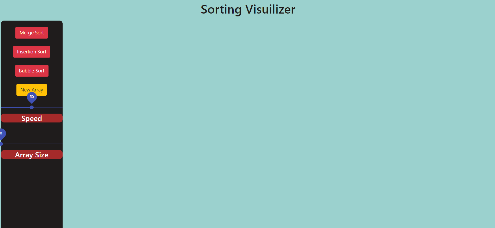
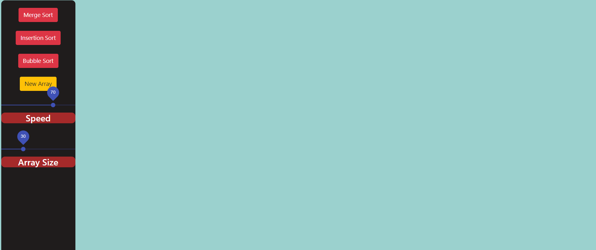
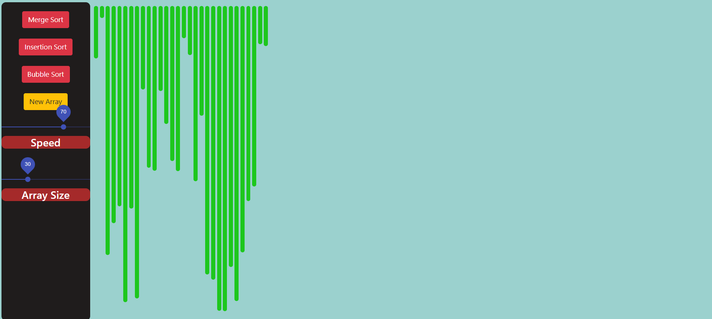
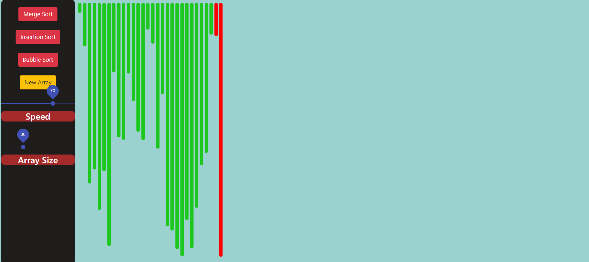
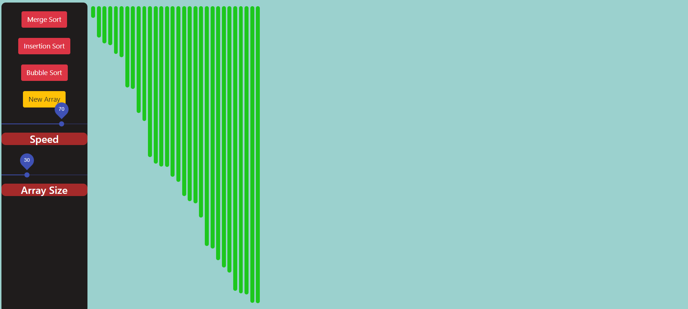
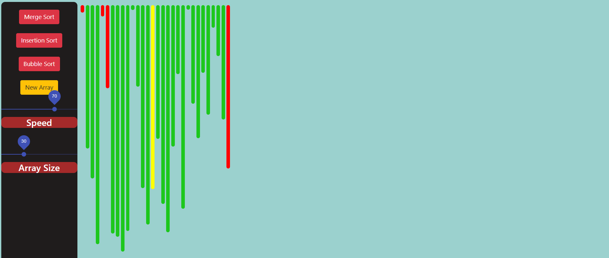
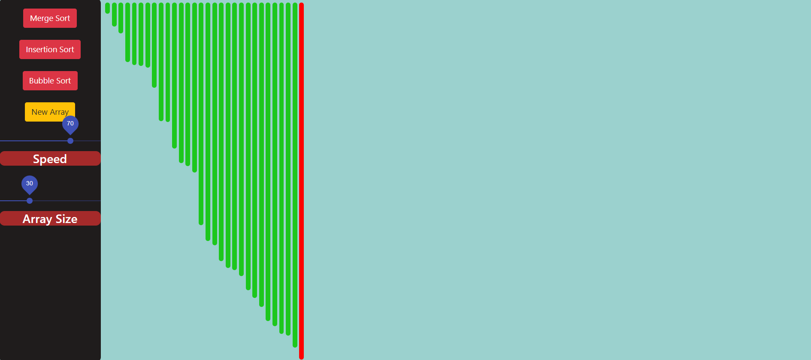
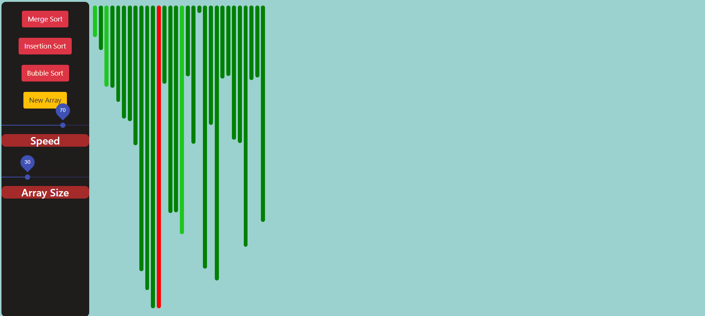
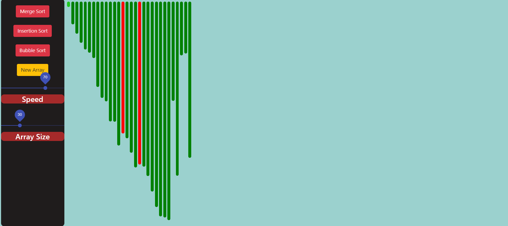

# Sorting Visualizer
This is a Web Application which lets you visualize different sorting algorithms like Bubble Sort, Merge Sort, etc. 

## Features
1. It helps to visualize various sorting algorithms like bubble srot, merge sort, etc.
2. It makes the understanding of these algorithms easier.
3. User-friendly interface
4. The size of the array and speed of animation is adjustable.
5. Its fun to play around with :)

## User Interface
The user interface has two sections
1. **The navigation bar** : It has different options like choosing the size of array, adjusting the speed of animation, choosing the sorting algorithm and selecting a new array.
2. **The animation area** : The area has animation that helps to visualize the selected algorithm.

## Options
1. **Merge sort** : This button is clicked if we want to visualize the merge sort algorithm. It heps us to understand the recursive nature of the algorithm.
2. **Insertion Sort** : This button is used to visualize the Insertion sort algorithm.
3. **Bubble sort** :  This helps to visualize the bubble sort algorithm. Red colour is used to show the node which is being considered and how the swapping is done.
4. **Array size button** : This is a slide based option ranging from 0 to 100. It is used to select the size of the array that we want to sort and visualize. If we slide towards left, the size of the array decreases. If we move towards right, the size of the array increases. 
5. **Speed button** : This is a slide based option used to select the speed of the animation ranging from 0 to 100. If we slide towards left, the speed decreases. If we slide towards right, the speed increases. After selecting the speed, we willbe able to visualize the algorithm at the chosen speed.
 

## Screenshots
1. Starting page 

2. Selecting the speed of animation and size of array

3. Clicking on 'New array'

4. On clicking bubble sort (in action)

Sorted array using bubble sort

5. On clicking merge sort (in action)

Sorted array using merge sort

6. On clicking Insertion sort

